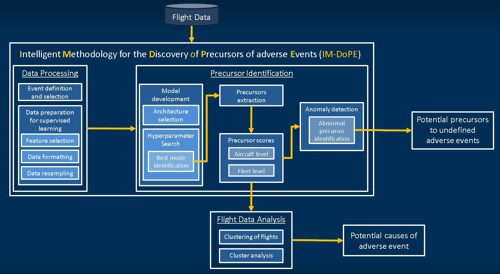

# Work in Progress
This package is currently work in progress. The project is projected to be completed by May 2021. A version of this work was published at the [AIAA SciTech 2021 Forum](https://arc.aiaa.org/doi/abs/10.2514/6.2021-0776)

# Precursor Analysis Overview
Identification and analysis of precursors of time-series using the Intelligent Methodology for the Discovery of Precursor of adverse Events (IM-DoPE). 



# Data processing
```
cd ../PrecursorAnalysis
python -m imdope.buildDataModel --nominal-directory"Data/toy_data/nominal_events" --adverse-directory "Data/toy_data/adverse_events" --verbose 1 --correlation-thres 0.9 --target-feature "Label"
```
Expected output of data processing using IM-DoPE:
```
Flight Length set to 100
Keeping only the following columns: Index(['Param1', 'Param2', 'Param3', 'Param4', 'Param5', 'Param6', 'Param7',
       'Param8', 'Param9', 'Param10', 'filename', 'flight_id', 'Anomaly'],
      dtype='object')
Now Concatenating all flights into a dataframe
Data Model Saved! (path: ../PrecursorAnalysis\Data\MyDataContainer.pkl)
List of features used:
Index(['Param1', 'Param2', 'Param3', 'Param4', 'Param5', 'Param6', 'Param7',
       'Param8', 'Param9', 'Param10', 'filename', 'flight_id', 'Anomaly'],
      dtype='object')
Data Model Saved! (path: ../PrecursorAnalysis\Data\MyDataContainer.pkl)
Data Model Saved! (path: ../PrecursorAnalysis\Data\MyDataContainer_MIL.pkl)
training size: (280, 100, 12)
validation size: (24, 100, 12)
test size: (96, 100, 12)
Data Model Saved! (path: ../PrecursorAnalysis\Data\MyDataContainer_MIL.pkl)

```

# Training a model
The model can be trained directly from the root of the repo using:
```
cd ../PrecursorAnalysis
python -m imdope.train --model-type "imdope_binary" --lr 0.001 --l2 0.01 --ks 8 5 3 --out-channels 10 15 20 --use-str
atisfy True --model-name "test_model.pt" --epochs 100 --data-container "./Data/MyDataContainer_MIL.pkl" --use-cuda True --mini-batch-percent 0.25

```
# Using pre-trained model
A model that was previously trained can be used for inference using:
```
cd ../PrecursorAnalysis
python -m imdope.train --load-model True --model-name "test_model.pt" --data-container "./Data/MyDataContainer_MIL.pkl" --use-cuda True
```
The model is evaluated on the test set, whether it was just trained or a pre-trained model was used, and the results will be printed as follow:

|     |     |     |     |     |
| --- | --- | --- | --- | --- |
|     | Precision | Recall | f1-score | support |
| 0   | 1   | 1   | 1   | 48  |
| 1   | 1   | 1   | 1   | 48  |
|	|	| | | |
| accuracy |     |     | 1   | 96  |
| macro avg | 1   | 1   | 1   | 96  |
| weighted avg | 1   | 1   | 1   | 96  |

# Precursor Discovery
The precursor of a time series with id 5 of interest can be identified:
```
python -m imdope.precursorIdentification --filename "./Data/MyDataContainer_MIL.pkl" --flight-id 19 --use-cuda True

```
The precursor will be extracted directly from the model architecture as described in the paper
List of outputs:
- [Feature ranking](Data/Flight_19_Anomaly1/predictors_ranking.png)
- [CNN feature map](Data/Flight_19_Anomaly1/precursor_proba.pdf)
- [Feature means and standard deviations](Data/Flight_19_Anomaly1/flight_parameters.pdf)
